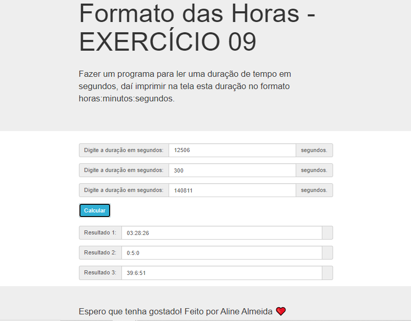

# Jovens Tegranos Exercicio 09

# 🏁 Tópicos

 * 👉 Banner
 * 👉 Título e Descrição
 * 👉 Status do Projeto
 * 👉 Funcionalidades
 * 👉 Demonstração da aplicação
 * 👉 Pré-requisitos
 * 👉 Tecnologias utilizadas
 * 👉 Autor
 * 👉 Licença
 
 ____________________________________________________________
# ✅ Banner 👌

<h1 align="center">
  
</h1>

# ✅ Título e Descrição 👌

### Título: Exercicio 09

Descrição: Fazer um programa para ler uma duração de tempo em segundos, daí imprimir na tela esta duração no formato horas:minutos:segundos.

# ✅ Status do Projeto 👌

🚧 Projeto 🚀 Concluído com Sucesso!!! 👌 🚧

# ✅ Funcionalidades 👌

Funcionalidades da aplicação:

- [x] Ler uma duração de tempo em segundos
- [x] Imprimir na tela esta duração no formato horas:minutos:segundos.

# ✅ Demonstração da aplicação 👌

### GitHub
### AlineAlmeida85

### Link: [Projeto](https://alinealmeida85.github.io/Jovens-Tegranos-Exercicio09/)

<h1 align="center">
  
</h1>

# ✅ Pré-requisitos 👌

Nenhum, basta clicar no link acima

# ✅ Tecnologias utilizadas ⚒️ 👌

As seguintes tecnologias foram usadas na construção do projeto:

- [HTML](https://pt.wikipedia.org/wiki/HTML)
- [CSS](https://pt.wikipedia.org/wiki/Cascading_Style_Sheets)
- [JavaScript](https://www.javascript.com/)

# ✅ Autor 👌

Aline Almeida 💝

# ✅ Licença

Não Possui

Espero que te agrade! ❤️
